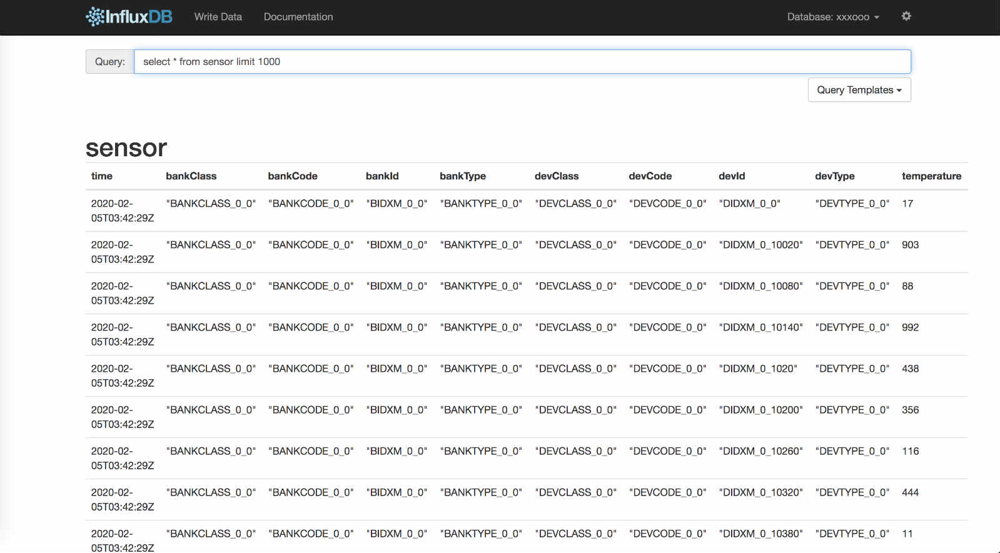

# influxdb-cluster

influxdb-cluster是基于influxdb1.7.x版本以及分布式Raft协议开发的分布式时序数据库，具有influxdb本身的特性之外，还有容量扩展、副本容错等集群功能。

Fork from angopher/chronus

## Features

- influxdb基于1.7.x版本，功能上都兼容

- 元数据节点和数据节点都可水平线性扩展 

- 元数据节点强一致性，数据节点最终一致性  

## Architecture

- meta server：负责元数据的存储和管理

- data server：负责数据的存储和管理，并向meta server获取元数据。所有涉及到元数据的修改，都会请求到meta server，由meta server执行修改，并同步给集群内所有的data server

## compile
 
- export GOPROXY=https://goproxy.io

- mkdir -p workspace/src/github.com/influxdb-cluster && export GOPATH=$PWD/workspace

- cd workspace/src/github.com/influxdb-cluster

- git clone git@github.com:lichong2005/influxdb-cluster.git && cd influxdb-cluster

- 编译influxd： cd cmd/influxd && go build  

- 编译metad：cd cmd/metad && go build

## run

配置启动meta server

- 生成默认配置文件：./metad config > metad.conf

- ./metad -config metad.conf

配置启动data server

- 生成默认配置文件 ./influxd config > influxd.conf

- ./influxd -config influxd.conf

## Getting Started

# 界面

浏览器打开：http://localhost:8083 即可

# 命令行操作

创建第一个数据库
- curl -XPOST "http://localhost:8086/query" --data-urlencode "q=CREATE DATABASE mydb"

写入数据
- curl -XPOST "http://localhost:8086/write?db=mydb" -d 'cpu,host=server01,region=uswest load=42 1434055562000000000'
- curl -XPOST "http://localhost:8086/write?db=mydb" -d 'cpu,host=server02,region=uswest load=78 1434055562000000000'
- curl -XPOST "http://localhost:8086/write?db=mydb"  -d 'cpu,host=server03,region=useast load=15.4 1434055562000000000'

查询
- curl -G "http://localhost:8086/query?pretty=true" --data-urlencode "db=mydb" --data-urlencode "q=SELECT * FROM cpu WHERE host='server01' AND time < now() - 1d"

分析
- curl -G "http://localhost:8086/query?pretty=true" --data-urlencode "db=mydb" --data-urlencode "q=SELECT mean(load) FROM cpu WHERE region='uswest'"

## License
Influxdb-cluster is under the MIT license. See the [LICENSE](LICENSE) file for details.
